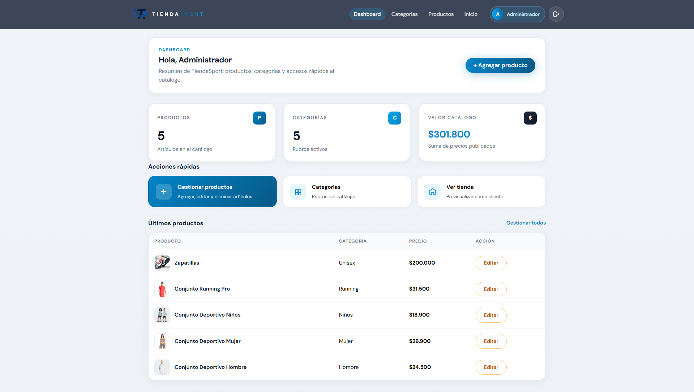
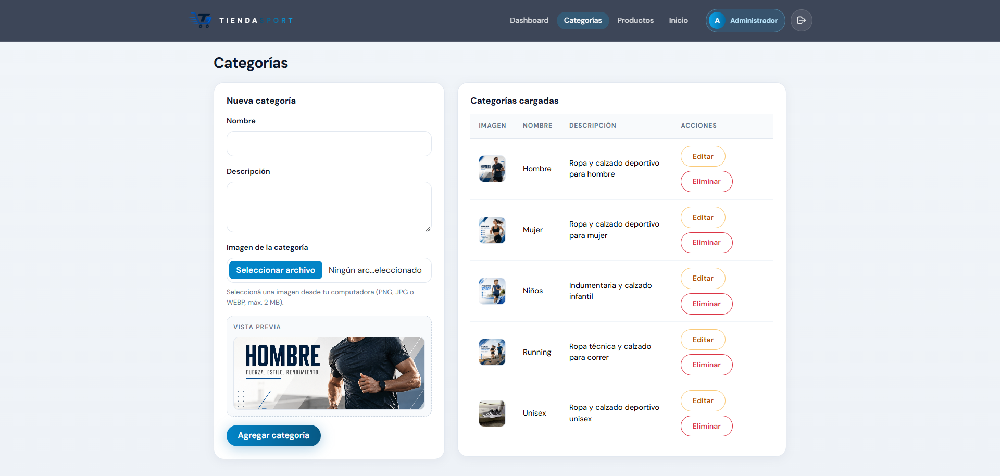
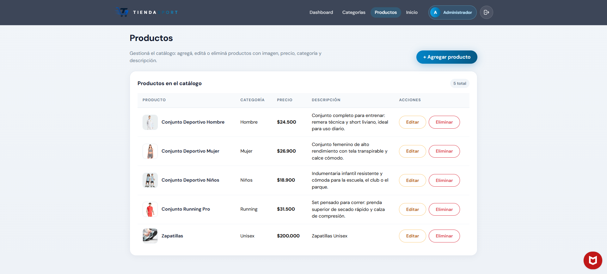
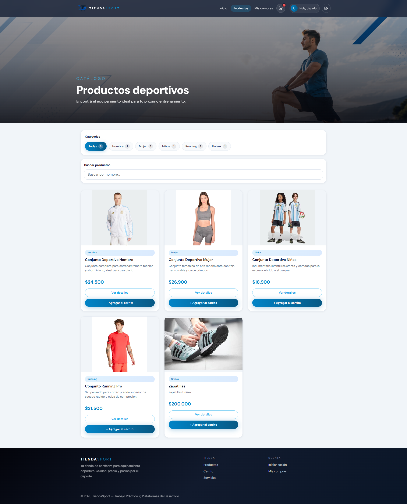
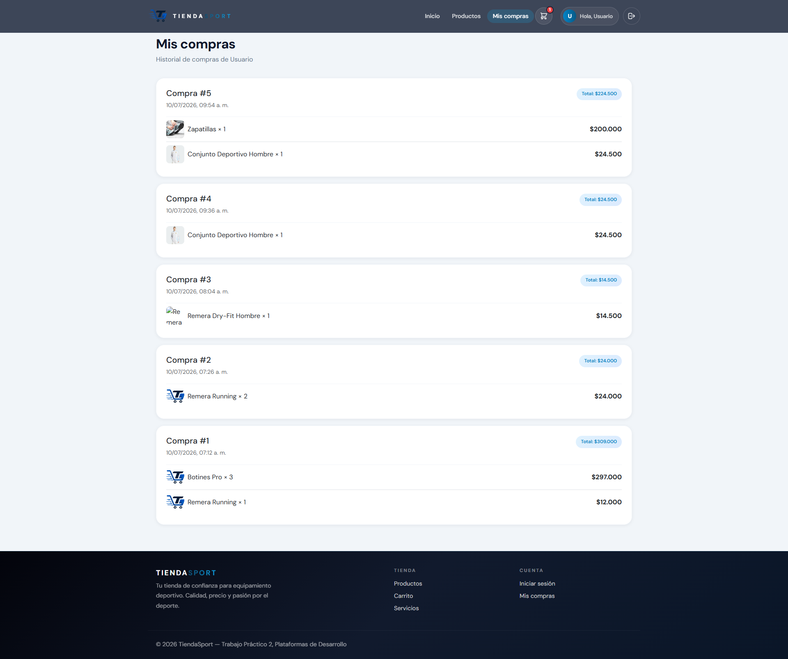

# TiendaSport — TP2

## Integrante

Fuentealba Alexis Gabriel

## Descripción

TiendaSport es una tienda deportiva online hecha con React. Los usuarios pueden ver productos, usar el carrito y comprar. El administrador puede cargar, editar y eliminar productos y categorías.

Los datos se cargan desde archivos JSON en `public/` y se guardan en el navegador con localStorage. Viene con categorías y productos de ejemplo para que se vea algo al abrirlo.

## Temática

Tienda de indumentaria y equipamiento deportivo.

## Usuarios y roles

| Rol           | Email              | Contraseña |
|---------------|--------------------|------------|
| Administrador | `admin@email.com`  | `admin123` |
| Usuario       | `usuario@email.com`| `user123`  |

El admin entra al panel y gestiona el catálogo. El usuario común solo compra y ve sus pedidos.

## Repositorio

https://github.com/alexisfuentealba/tiendasport-tp2

## Cómo levantar el proyecto

```bash
npm install
npm run dev
```

Para producción:

```bash
npm run build
npm run preview
```

## Funcionalidades

- Inicio con categorías y productos destacados
- Catálogo con búsqueda y filtros
- Detalle de producto
- Login y logout
- Carrito y mis compras
- CRUD de productos y categorías (admin)

## Capturas












## Deploy

[Completar link cuando esté publicado]
